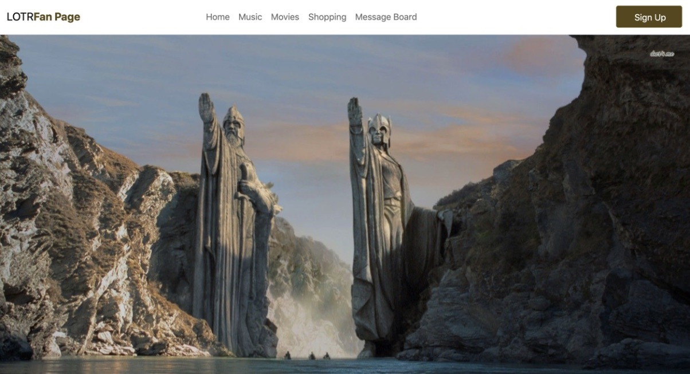
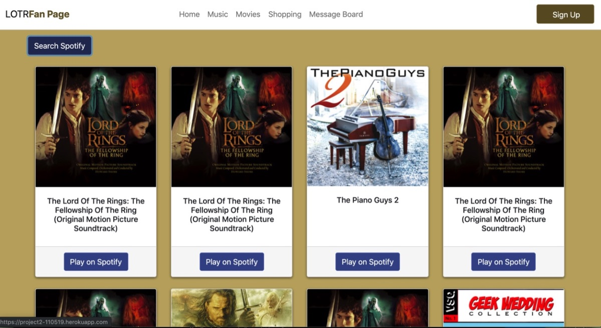
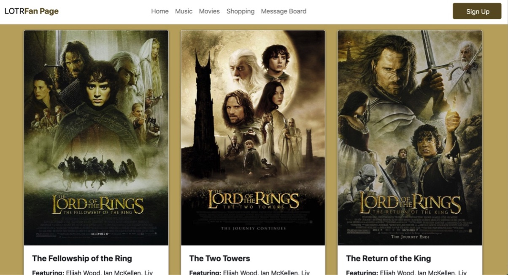
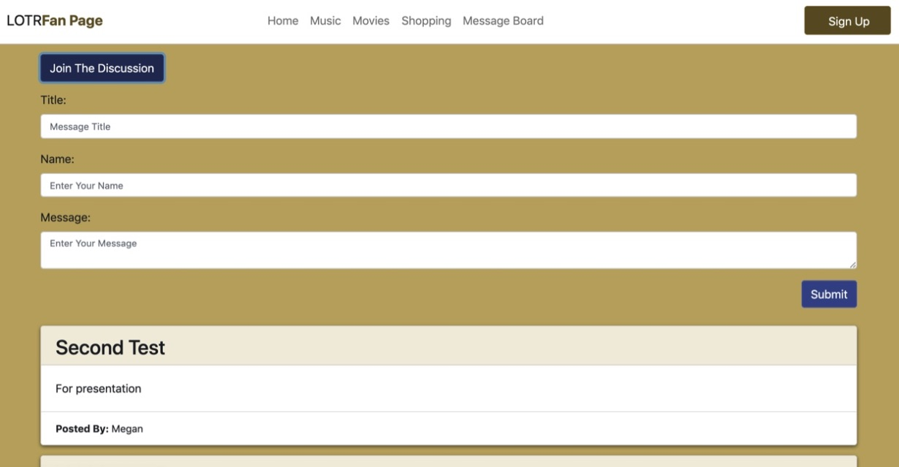

# Project-2
This is the second group project for Vanderbilt's Coding Bootcamp. 

# Links
https://github.com/MMvogler/Project-2
https://project2-110519.herokuapp.com/ 

## Original Inspiration
This site was created as a Lord of the Rings fan page. A place to access LOTR music, movies, join the newsletter (with a sign up form), and post a message to our message board. 

## Technology Used
- jQuery 
- Spotify API
- hover.css library
- Bootstrap
- MySQL database

## Home Screen Shot

## Music Screen Shot

## Movies Screen Shot

## Message Board Screen Shot 

## Future Goals
- create a log in with a user name
- Making a more interactive message board
- Additional shopping and travel opportunities